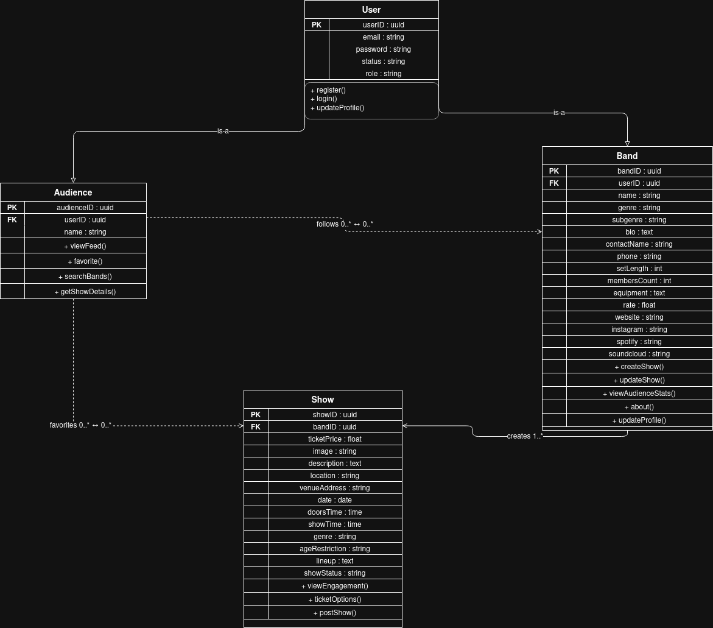

<<<<<<< HEAD
# Scene Scout - Backend API Documentation

**Version:** 1.0
**Last Updated:** March 24, 2026
**Base URL:** `http://localhost:8080`

---

## Table of Contents

1. [Overview](#1-overview)
2. [User Roles](#2-user-roles)
3. [UML Class Diagram](#3-uml-class-diagram)
4. [API Endpoints](#4-api-endpoints)
   - [Band Management](#band-management)
   - [Show Management](#show-management)
5. [Use Case Mapping](#5-use-case-mapping)

---

## 1. Overview

The Scene Scout Backend API provides a RESTful interface for managing local live music shows in the Greensboro, NC area.

- **Band Profiles**: Bands can register, manage their profile, and list shows
- **Show Listings**: Bands can post, update, and delete show listings with full details
- **Discovery**: Audiences can browse shows by genre, band, or location

---

## 2. User Roles

| Role | Description | Primary Responsibilities |
|------|-------------|--------------------------|
| **BAND** | Local band or artist (Provider) | Create/manage profile, post and manage show listings |
| **AUDIENCE** | Local music fan (Customer) | Browse shows, view show details, find local events |

---

## 3. UML Class Diagram



---

## 4. API Endpoints

**Note:** Bands are created through the `/bands` endpoint. The base `User` class handles shared fields (email, passwordHash, role, status) using JOINED inheritance with the `users` table.

---

### Band Management

#### Create Band Profile
**Endpoint:** `POST /bands`
**Use Case:** US-PROV-001 (Band Registration)
**Description:** Register a new band account with profile information.

```http
POST /bands
Content-Type: application/json

{
  "email": "thestrokes@example.com",
  "passwordHash": "hashed_password",
  "role": "BAND",
  "status": "ACTIVE",
  "name": "The Strokes",
  "genre": "Indie Rock",
  "subgenre": "Post-Punk Revival",
  "bio": "A 5-piece indie rock band from Greensboro, NC.",
  "contactName": "Julian Casablancas",
  "phone": "336-555-0101",
  "setLength": 60,
  "membersCount": 5,
  "equipment": "Full backline provided. Need PA and monitors.",
  "rate": 200.00,
  "website": "https://thestrokes.com",
  "instagram": "@thestrokes",
  "spotify": "thestrokes",
  "soundcloud": "thestrokes"
=======
# Customer API & Use Case Documentation


## 1. Customer Actions
Customers can:
- Create and manage their profile  
- Set preferred genres  
- Follow bands  
- Mark interest in shows  
- View local show listings  


## 2. Customer Endpoints


#### Create Customer
**Endpoint:** `POST /api/customers`  
**Description:** Create a new customer account.

```http
POST /api/customers
Content-Type: application/json

{
  "email": "john@example.com",
  "passwordHash": "hashedpassword123",
  "role": "CUSTOMER",
  "status": "ACTIVE",
  "name": "John Doe",
  "bio": "This is a bio",
  "location": "Greensboro, NC",
  "profilePictureUrl": "https://example.com/pfp.jpg"
>>>>>>> origin/main
}
```

**Response:**
```json
{
<<<<<<< HEAD
  "userId": 1,
  "email": "thestrokes@example.com",
  "role": "BAND",
  "status": "ACTIVE",
  "name": "The Strokes",
  "genre": "Indie Rock",
  "subgenre": "Post-Punk Revival",
  "bio": "A 5-piece indie rock band from Greensboro, NC.",
  "contactName": "Julian Casablancas",
  "phone": "336-555-0101",
  "setLength": 60,
  "membersCount": 5,
  "equipment": "Full backline provided. Need PA and monitors.",
  "rate": 200.00,
  "website": "https://thestrokes.com",
  "instagram": "@thestrokes",
  "spotify": "thestrokes",
  "soundcloud": "thestrokes"
}
```

**Status Code:** `200 OK`

---

#### Get All Bands
**Endpoint:** `GET /bands`
**Use Case:** Browse all registered bands
**Description:** Retrieve a list of all band profiles.

```http
GET /bands
=======
  "userId": 9,
  "email": "john@example.com",
  "role": "CUSTOMER",
  "status": "ACTIVE",
  "name": "John Doe",
  "bio": "This is a bio",
  "location": "Greensboro, NC",
  "profilePictureUrl": "https://example.com/pfp.jpg",
  "preferredGenres": []
}
```

**Status Code:** `201 Created`

---

#### Get All Customers
**Endpoint:** `GET /api/customers`  
**Description:** Retrieve all customers

```http
GET /api/customers
>>>>>>> origin/main
```

**Status Code:** `200 OK`

---

<<<<<<< HEAD
#### Get Band by ID
**Endpoint:** `GET /bands/{id}`
**Use Case:** View a specific band's profile
**Description:** Retrieve a specific band by their user ID.

```http
GET /bands/1
=======
#### Get Customer by ID
**Endpoint:** `GET /api/customers/{id}`  
**Description:** Retrieve a specific customer by ID.

```http
GET /api/customers/9
>>>>>>> origin/main
```

**Status Code:** `200 OK` or `404 Not Found`

---

<<<<<<< HEAD
#### Get Bands by Genre
**Endpoint:** `GET /bands/genre/{genre}`
**Use Case:** Genre-based band discovery
**Description:** Retrieve all bands in a specific genre.

```http
GET /bands/genre/Indie%20Rock
```

**Response:** Array of band objects matching the genre

**Status Code:** `200 OK`

---

#### Update Band Profile
**Endpoint:** `PUT /bands/{id}`
**Use Case:** US-PROV-001 (Update Band Profile)
**Description:** Update an existing band's profile information.

```http
PUT /bands/1
Content-Type: application/json

{
  "bio": "Updated bio — now playing venues across Greensboro.",
  "rate": 250.00,
  "instagram": "@thestrokesgsb"
}
```

**Response:** Updated band object

=======
#### Get Customer by Email
**Endpoint:** `GET /api/customers/email/{email}`  
**Description:** Retrieve a customer by email address.

```http
GET /api/customers/email/john@example.com
```

**Status Code:** `200 OK` or `404 Not Found`

---

#### Update Customer
**Endpoint:** `PUT /api/customers/{id}`  
**Description:** Update customer profile information.

```http
PUT /api/customers/9
Content-Type: application/json

{
  "email": "john123@example.com",
  "name": "John Doe",
  "bio": "Updated bio",
  "location": "Greensboro, NC",
  "profilePictureUrl": "https://example.com/pfp.jpg"
}
```

**Response:** Updated customer object  
**Status Code:** `200 OK` or `404 Not Found`

---

#### Update Customer Preferred Genres
**Endpoint:** `PUT /api/customers/{id}/genres`  
**Description:** Set a customer's preferred genres by genre IDs.

```http
PUT /api/customers/9/genres
Content-Type: application/json

[1, 2, 3]
```

**Response:** Updated customer object with preferred genres  
**Status Code:** `200 OK` or `400 Bad Request`

---

#### Follow a Band
**Endpoint:** `POST /api/customers/{id}/follow/{bandId}`  
**Description:** Follow a band as a customer.

```http
POST /api/customers/9/follow/2
```

**Status Code:** `201 Created` or `400 Bad Request`

---

#### Unfollow a Band
**Endpoint:** `DELETE /api/customers/{id}/follow/{bandId}`  
**Description:** Unfollow a band.

```http
DELETE /api/customers/9/follow/2
```

**Status Code:** `204 No Content` or `400 Bad Request`

---

#### Get Followed Bands
**Endpoint:** `GET /api/customers/{id}/following`  
**Description:** Get all bands a customer follows.

```http
GET /api/customers/9/following
```

**Response:** Array of band objects  
>>>>>>> origin/main
**Status Code:** `200 OK`

---

<<<<<<< HEAD
#### Delete Band Profile
**Endpoint:** `DELETE /bands/{id}`
**Use Case:** Account removal
**Description:** Delete a band account.

```http
DELETE /bands/1
```

**Status Code:** `204 No Content`

---

### Show Management

#### Create Show
**Endpoint:** `POST /shows`
**Use Case:** US-PROV-002 (Post a Show)
**Description:** A band creates a new show listing with full event details.

```http
POST /shows
Content-Type: application/json

{
  "band": { "userId": 1 },
  "ticketPrice": 10.00,
  "image": "https://example.com/poster.jpg",
  "description": "An intimate indie rock night in a basement venue.",
  "location": "The Blind Tiger",
  "venueAddress": "1819 Spring Garden St, Greensboro, NC 27403",
  "date": "2026-04-12",
  "doorsTime": "19:00:00",
  "showTime": "20:00:00",
  "genre": "Indie Rock",
  "ageRestriction": "All Ages",
  "lineup": "The Strokes, Opening Act TBA",
  "showStatus": "ACTIVE"
=======
#### Mark Interest in a Show
**Endpoint:** `POST /api/customers/{id}/interested/{showId}`  
**Description:** Mark a customer as interested in a show.

```http
POST /api/customers/9/interested/1
```

**Status Code:** `200 OK` or `400 Bad Request`

---
### 3. Genre Endpoints 

#### Create Genre
**Endpoint:** `POST /api/genres`  
**Description:** Create a new genre.

```http
POST /api/genres
Content-Type: application/json

{
  "name": "Rock"
>>>>>>> origin/main
}
```

**Response:**
```json
{
<<<<<<< HEAD
  "showId": 10,
  "band": { "userId": 1, "name": "The Strokes" },
  "ticketPrice": 10.00,
  "image": "https://example.com/poster.jpg",
  "description": "An intimate indie rock night in a basement venue.",
  "location": "The Blind Tiger",
  "venueAddress": "1819 Spring Garden St, Greensboro, NC 27403",
  "date": "2026-04-12",
  "doorsTime": "19:00:00",
  "showTime": "20:00:00",
  "genre": "Indie Rock",
  "ageRestriction": "All Ages",
  "lineup": "The Strokes, Opening Act TBA",
  "showStatus": "ACTIVE"
}
```

**Status Code:** `200 OK`

---

#### Get All Shows
**Endpoint:** `GET /shows`
**Use Case:** US-CUST-001 (Browse Local Show Feed)
**Description:** Retrieve all show listings.

```http
GET /shows
=======
  "genreId": 1,
  "name": "Rock"
}
```

**Status Code:** `201 Created`

---

#### Get All Genres
**Endpoint:** `GET /api/genres`  
**Description:** Retrieve all genres.

```http
GET /api/genres
```

**Response:**
```json
[
  { "genreId": 1, "name": "Rock" },
  { "genreId": 2, "name": "Metal" },
  { "genreId": 3, "name": "Hip-Hop" },
  { "genreId": 4, "name": "Indie" }
]
>>>>>>> origin/main
```

**Status Code:** `200 OK`

---

<<<<<<< HEAD
#### Get Show by ID
**Endpoint:** `GET /shows/{id}`
**Use Case:** US-CUST-003 (View Show Details)
**Description:** Retrieve a specific show by ID.

```http
GET /shows/10
```

**Status Code:** `200 OK` or `404 Not Found`

---

#### Get Shows by Band
**Endpoint:** `GET /shows/band/{bandId}`
**Use Case:** View all shows posted by a specific band
**Description:** Retrieve all show listings for a given band.

```http
GET /shows/band/1
```

**Response:** Array of show objects for that band

**Status Code:** `200 OK`

---

#### Get Shows by Genre
**Endpoint:** `GET /shows/genre/{genre}`
**Use Case:** US-CUST-005 (Search Shows by Genre)
**Description:** Retrieve all shows in a specific genre.

```http
GET /shows/genre/Indie%20Rock
```

**Response:** Array of show objects matching the genre

**Status Code:** `200 OK`

---

#### Update Show
**Endpoint:** `PUT /shows/{id}`
**Use Case:** US-PROV-003 (Update Show Listing)
**Description:** Update an existing show listing (e.g., change time, price, or status).

```http
PUT /shows/10
Content-Type: application/json

{
  "ticketPrice": 12.00,
  "showTime": "21:00:00",
  "showStatus": "CANCELLED"
}
```

**Response:** Updated show object

**Status Code:** `200 OK`

---

#### Delete Show
**Endpoint:** `DELETE /shows/{id}`
**Use Case:** US-PROV-003 (Delete Show Listing)
**Description:** Delete a show listing.

```http
DELETE /shows/10
```

**Status Code:** `204 No Content`

---

## 5. Use Case Mapping

### Provider (Band) Use Cases — Yash Patel

| Use Case | Description | Related Endpoints |
|----------|-------------|-------------------|
| **US-PROV-001** | Band registration and profile management | `POST /bands`, `GET /bands/{id}`, `PUT /bands/{id}`, `DELETE /bands/{id}` |
| **US-PROV-002** | Post a show with full details (date, venue, price, genre) | `POST /shows` |
| **US-PROV-003** | Update or delete show listings | `PUT /shows/{id}`, `DELETE /shows/{id}` |
| **US-PROV-004** | Add venue and location to shows | `POST /shows` (`location`, `venueAddress` fields), `PUT /shows/{id}` |

=======
## 4. Use Case Mapping

### Customer Use Cases

| Use Case | Description | Related Endpoints |
|----------|-------------|-------------------|
| **US-CUST-001**  | Create/manage customer profile | `POST /api/customers`, `PUT /api/customers/{id}` |
| **US-CUST-002** | Login and view local feed | `GET /shows`, `GET /shows/genre/{genre}` |
| **US-CUST-003** | View show details | `GET /shows/{id}` |
| **US-CUST-004** | Save/bookmark shows | `POST /api/customers/{id}/interested/{showId}`, `GET /api/customers/{id}/interested` |
| **US-CUST-005**  | Follow bands | `POST /api/customers/{id}/follow/{bandId}`, `GET /api/customers/{id}/following` |
| **US-CUST-006** | Search for local shows | `GET /shows/genre/{genre}`, `GET /bands/genre/{genre}` |
| **US-CUST-007** | Set preferred genres | `PUT /api/customers/{id}/genres` |
>>>>>>> origin/main
